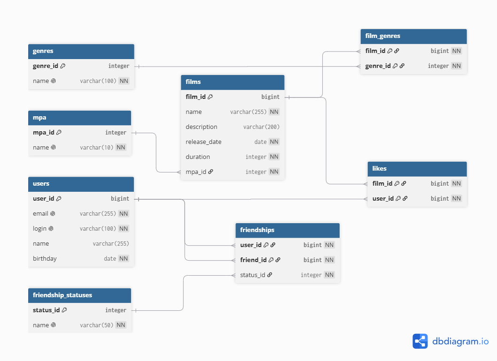

# java-filmorate
Template repository for Filmorate project.

## Схема базы данных



### Описание схемы

База данных Filmorate состоит из таблиц для хранения пользователей, фильмов, жанров, рейтингов MPA, лайков и дружбы пользователей.

Таблица `users` хранит данные пользователей: электронную почту, логин, имя и дату рождения.

Таблица `films` хранит данные фильмов: название, описание, дату релиза, продолжительность и ссылку на рейтинг MPA.

Таблица `mpa` является справочником возрастных рейтингов фильма: G, PG, PG-13, R, NC-17.

Таблица `genres` является справочником жанров фильма.

Так как у фильма может быть несколько жанров, связь между фильмами и жанрами вынесена в отдельную таблицу `film_genres`.

Лайки пользователей хранятся в таблице `likes`. Составной первичный ключ `(film_id, user_id)` не позволяет одному пользователю поставить лайк одному фильму несколько раз.

Дружба пользователей хранится в таблице `friendships`. Поле `user_id` обозначает пользователя, который отправил заявку или имеет связь дружбы, поле `friend_id` - второго пользователя, а поле `status_id` указывает на статус дружбы.

Таблица `friendship_statuses` хранит возможные статусы дружбы: неподтверждённая и подтверждённая.

### Примеры SQL-запросов

#### Получение всех пользователей

```
SELECT *
FROM users;
````

#### Получение всех фильмов с рейтингом MPA

```
SELECT f.film_id,
       f.name,
       f.description,
       f.release_date,
       f.duration,
       m.name AS mpa
FROM films AS f
JOIN mpa AS m ON f.mpa_id = m.mpa_id;
```

#### Получение жанров фильма

```
SELECT g.genre_id,
       g.name
FROM film_genres AS fg
JOIN genres AS g ON fg.genre_id = g.genre_id
WHERE fg.film_id = 1;
```

#### Получение топ-10 популярных фильмов

```
SELECT f.film_id,
       f.name,
       COUNT(l.user_id) AS likes_count
FROM films AS f
LEFT JOIN likes AS l ON f.film_id = l.film_id
GROUP BY f.film_id, f.name
ORDER BY likes_count DESC
LIMIT 10;
```

#### Получение друзей пользователя

```
SELECT u.*
FROM friendships AS fr
JOIN users AS u ON fr.friend_id = u.user_id
JOIN friendship_statuses AS fs ON fr.status_id = fs.status_id
WHERE fr.user_id = 1
  AND fs.name = 'CONFIRMED';
```