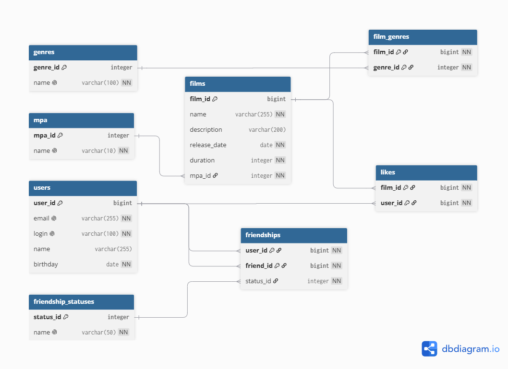

# Filmorate

Filmorate is a team-developed REST service for working with films and social interactions between users.

The application allows users to:
- create and manage film profiles;
- add friends;
- like films;
- view popular films;
- work with genres and MPA ratings;
- manage directors;
- create and rate reviews;
- receive user activity events.

## Tech stack

- Java
- Spring Boot
- Spring Web
- Spring JDBC
- H2
- Maven
- Lombok
- JUnit
- Git / GitHub

## Architecture

The project follows a layered architecture:

Controller → Service → Storage → Database

The database stores users, films, genres, MPA ratings, directors, reviews, likes, friendships and events.

## Database

Main relationships:
- Film ↔ Genre — many-to-many
- Film ↔ Director — many-to-many
- User ↔ Film — likes
- User ↔ User — friendships

## My contribution

This project was developed as a team project.

My personal contribution included:
- database schema design;
- CRUD operations for directors;
- film–director relationships;
- sorting director films by release year and popularity;
- validation for directors;
- endpoints for deleting films and users;
- integration of team changes into the main branch;
- participation in pull request review and team coordination.

## API examples

Examples of available endpoints:

GET /films
POST /films
PUT /films

GET /users
POST /users
PUT /users

GET /directors
POST /directors
PUT /directors/{id}
DELETE /directors/{id}

## Team development

Development was organized through feature branches and pull requests.

The project included:
- task distribution;
- code review;
- merge through the develop branch;
- final integration into main.
